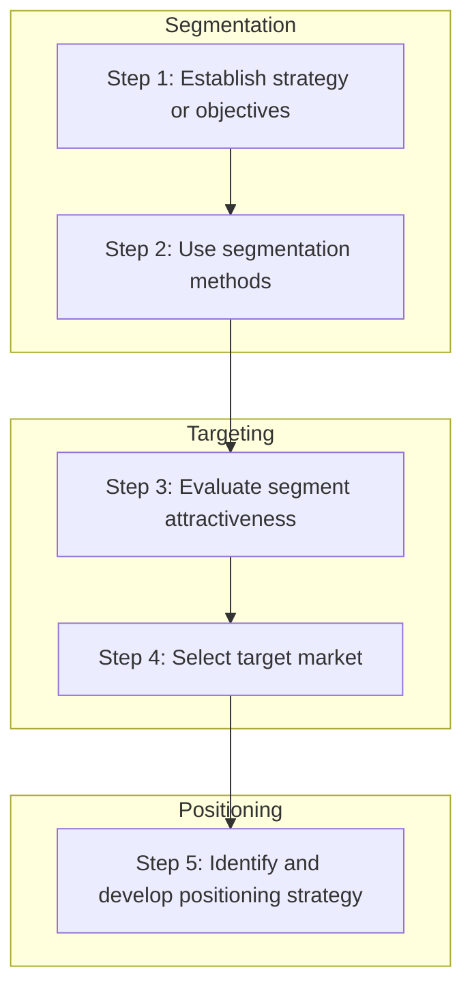

Ch.9 MKT
class: [[marketing]]
Third step in the Marketing Plan:
Segmentation, targeting, and positioning process:

Step 1: Establish the overall strategy or objectives
segmentation strategy derived from the company's mission and SWOT.

Step 2: Use segmentation methods
segment the market based on customer similarities in a market

Step 3: Evaluate segment attractiveness
attractiveness based off of:
- is it a distinctive piece of the market?
- is their buying power worthwhile?
- Is the segment reachable?
- Can you offer something that they will react positively to?
- is the segment profitable?

Step 4: Select a target market
 Marketing strategy:
 undifferentiated targeting strategy (or mass marketing) - fits the needs of many, (ex. salts, sugar, etc.)
 differentiate targeting strategy - targeting several market segments with individualized strategies for each.
 Concentrated targeting strategy - putting all effort into targeting a single market
Step 5: Identify and develop positioning strategy
Process to define what your product does and how it differs from competition.
Positioning methods:
- value proposition
- product attributes
- well known symbols
- position AGAINST their competition

Perceptual mapping - displays in multiple dimensions how a product appears in the customers mind using its attributes. Think: political compass, attribute :right politics, right economics = libertarian

goals for life = self-values
-sense of belonging
-self-respect
-self-indulgence

self-concept AKA self-image = view people have of themselves

how we live our lives to achieve goals = lifestyle

behavioral segmentation = segmenting market based on how customers use a product, more loyally or not.
- occasion segmentation = segmenting a market based on when a customer buys, pretty specialized segmentation
- loyalty segmentation = loyal customers, repeat business

Multiple segmentation methods:
- Market basket analysis = data analysis of whats in the basket, or ratio of products bought
- geodemographic segmentation = combo of geographic, demographic, and lifestyle characteristics to segment a market.
- when designing a product:
	- benefits, lifestyle

[[STP in relation to Charlie Munger's Investment Philosophy]]